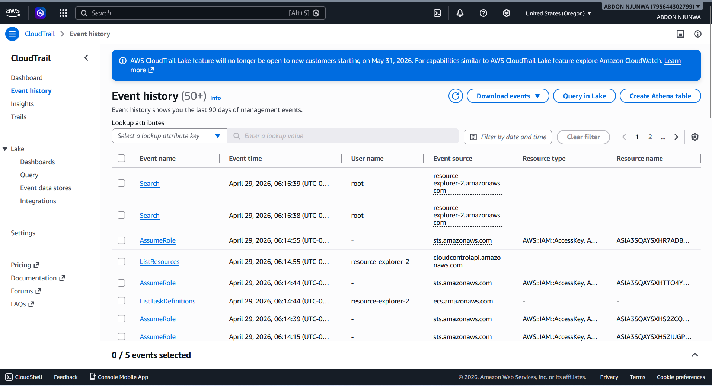
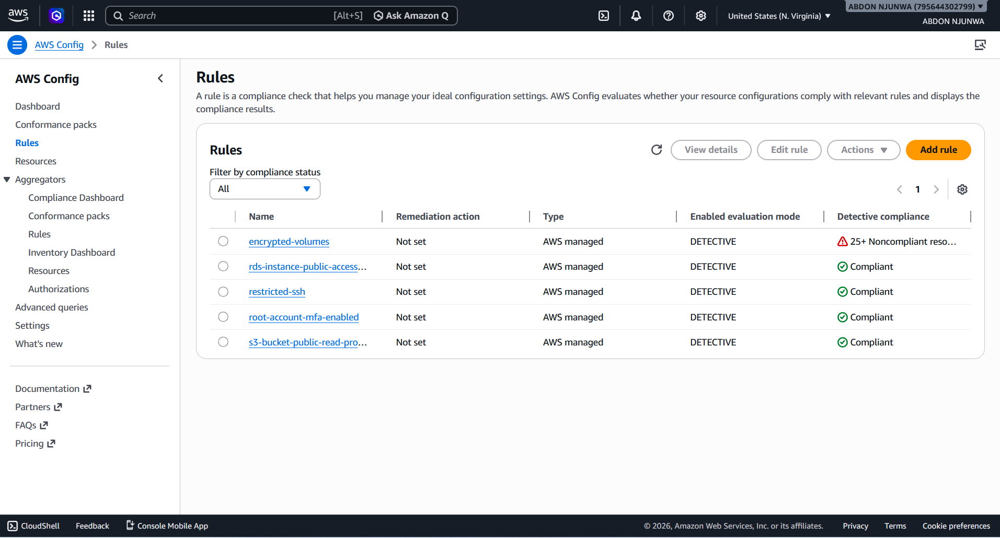

# AWS Secure Enterprise 3-Tier Web Platform 🚀

## Executive Summary

This project demonstrates the design and implementation of a secure, highly available, and scalable three-tier web application architecture on AWS.

The platform follows real-world cloud engineering practices by separating the application into multiple layers, implementing security controls, monitoring, compliance validation, and automated scaling.

The architecture is designed to improve reliability, security, and operational visibility.

---

# Architecture Overview

The solution follows a traditional enterprise three-tier architecture:

```
Users
 |
 v
AWS WAF
 |
 v
Application Load Balancer
 |
 v
EC2 Auto Scaling Group (Application Tier)
 |
 v
Amazon RDS MySQL (Database Tier)
```

Architecture components:

- Multi-AZ deployment
- Public and private subnet separation
- Load balancing
- Auto scaling
- Secure database isolation

---

# Project Goals

This project focuses on:

- Building production-style AWS infrastructure
- Implementing security best practices
- Creating highly available architecture
- Automating infrastructure operations
- Monitoring cloud resources
- Validating security controls

---

# AWS Services Used

## Compute

- Amazon EC2
- Launch Templates
- Auto Scaling Groups


## Networking

- Amazon VPC
- Public Subnets
- Private Subnets
- NAT Gateway
- Application Load Balancer


## Database

- Amazon RDS MySQL
- Private database deployment


## Security

- AWS WAF
- IAM Roles
- Security Groups


## Monitoring and Compliance

- Amazon CloudWatch
- AWS CloudTrail
- AWS Config

---

# High Availability Design

The application runs across multiple Availability Zones.

Benefits:

- Improved fault tolerance
- Automatic instance replacement
- Reduced downtime
- Better application availability


---

# Security Architecture

Security controls implemented:

## Network Security

- EC2 instances deployed without public IP addresses
- Database isolated in private subnets
- Least privilege security groups


## Identity Security

- IAM roles instead of hardcoded AWS credentials
- Controlled resource permissions


## Application Security

AWS WAF protects against common web attacks:

- SQL Injection
- Cross-Site Scripting (XSS)


---

# Auto Scaling Implementation

The application tier uses EC2 Auto Scaling.

Features:

- Automatic instance replacement
- Health check monitoring
- Dynamic capacity management


Validation:

Auto Scaling successfully replaced unhealthy instances.

Evidence:


---

# WAF Security Testing

The Web Application Firewall was tested against malicious requests.

Result:

Blocked attack traffic successfully.

Response:

HTTP 403 Forbidden


Evidence:


---

# Monitoring and Auditing

## CloudTrail

Tracks AWS API activity and provides audit history.

Implemented for:

- Security investigations
- Resource tracking
- Operational visibility


Evidence:




---

## AWS Config Compliance

AWS Config was used to evaluate infrastructure compliance.

Validated rules:

| Rule | Status |
|---|---|
| SSH restriction | Compliant |
| RDS public access disabled | Compliant |
| Root MFA enabled | Compliant |
| Public S3 prevention | Compliant |


Evidence:



---

# Application Deployment Validation

Application successfully deployed and accessible through the Application Load Balancer.

Evidence:


---

# CloudWatch Monitoring

Configured alarms:

| Metric | Condition |
|---|---|
| CPU Utilization | Above threshold |
| ALB Errors | Increased errors |
| Unhealthy Targets | Failed instances |
| RDS Storage | Low storage |
| Response Time | High latency |


---

# Infrastructure Security Principles

Implemented:

✅ Least privilege access  
✅ Private networking  
✅ Secure authentication  
✅ Monitoring and auditing  
✅ Automated recovery  


---

# Engineering Decisions

## Why Three-Tier Architecture?

Separating presentation, application, and database layers improves:

- Security
- Scalability
- Maintainability


## Why Auto Scaling?

Allows the application to automatically adjust capacity based on demand.

## Why Managed AWS Services?

Managed services reduce operational overhead and improve reliability.

---

# DevOps Skills Demonstrated

Cloud Engineering:

- AWS Architecture
- VPC Design
- EC2
- RDS
- IAM
- Load Balancing
- Security Implementation


DevOps:

- Infrastructure Management
- Monitoring
- Automation
- Troubleshooting


Security:

- WAF
- Compliance
- Auditing
- Access Control


---

# Future Improvements

- Add Terraform Infrastructure as Code
- Add CI/CD deployment pipeline
- Add containerized version using ECS/EKS
- Add centralized logging
- Add blue/green deployment strategy


---

# Author

Abdon Njunwa

AWS Certified Solutions Architect

Cloud & DevOps Engineer
